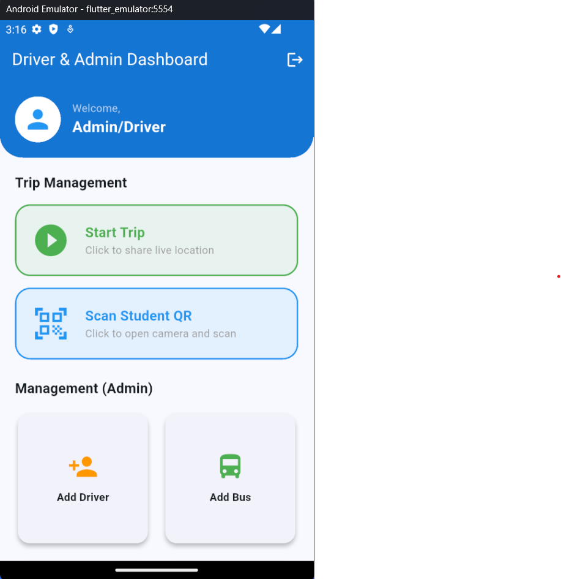
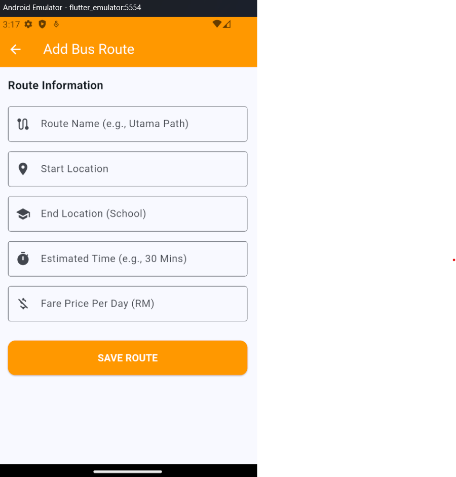
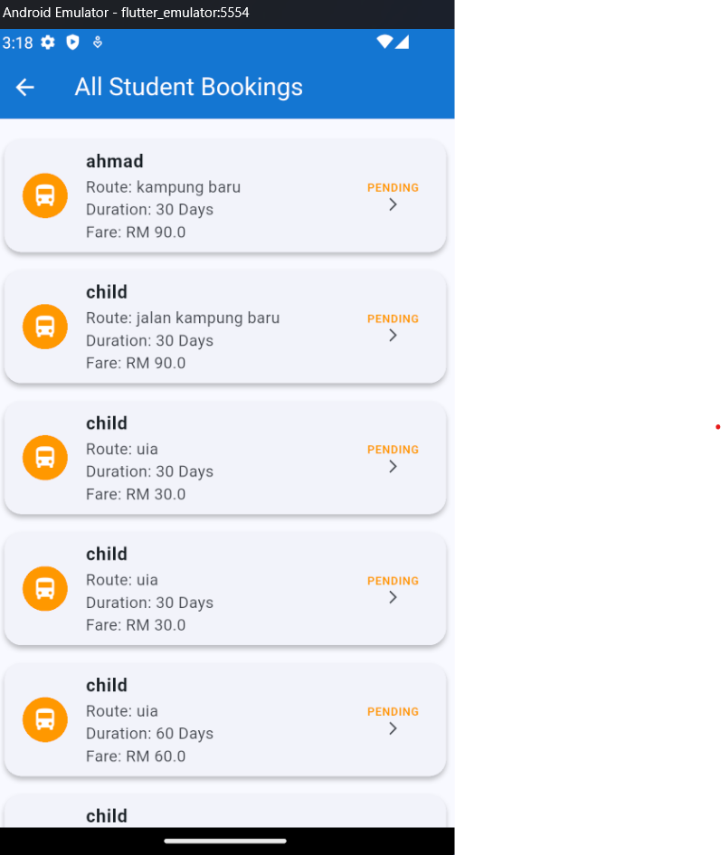
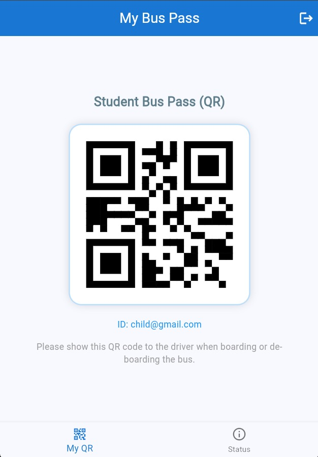
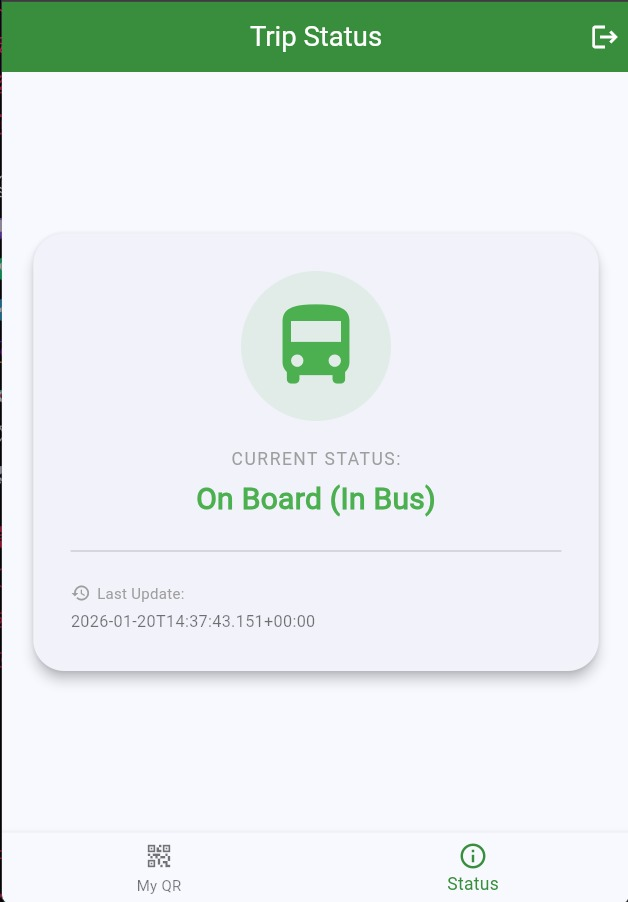
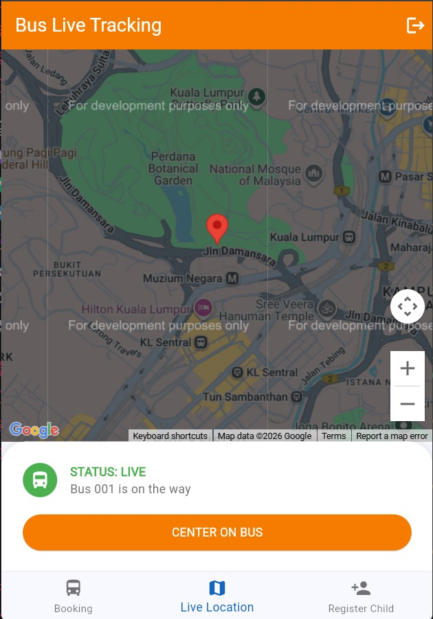
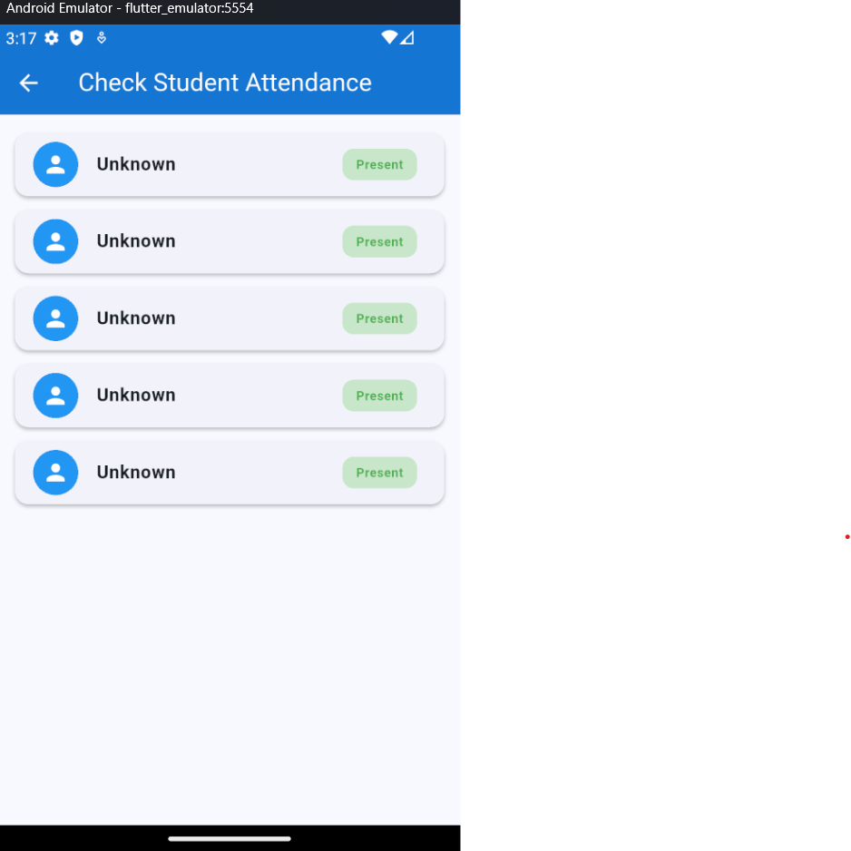

# 🚌 SchoolNow – Automated School Bus System (ASBS)
## Final Project Report (README.md)

---

## 1. Introduction

School transportation services play an important role in ensuring that students travel safely and arrive at school on time. In Malaysia, many school bus services still rely on manual processes such as handwritten attendance records and cash-based fare collection. These traditional approaches are inefficient, prone to human error, and provide limited visibility for parents regarding their children’s daily transportation activities.

The **Automated School Bus System (ASBS)**, known as **SchoolNow**, is a mobile-based application developed to address these challenges by replacing manual processes with a digital and automated solution. The system integrates **QR-based attendance tracking**, **digital bus booking**, and **real-time bus location tracking** to enhance safety, efficiency, and transparency for parents, students, bus drivers, and administrators.

This document serves as the **FINAL PROJECT REPORT** and reflects the **final implemented version** of the SchoolNow system, as required for project submission.

---

## 2. Application Domain

The SchoolNow system operates within the domains of **Transportation**, **Education Technology**, and **Safety Management**. By combining mobile application technology with automated fare collection concepts, the system improves school transportation management while prioritizing student safety and operational efficiency.

---

## 3. Problem Statement

School bus transportation services in Malaysia commonly depend on manual methods for recording student attendance and managing transportation fees. These methods are inefficient and often result in inaccurate records, delayed updates, and missing information. Parents usually lack real-time confirmation of whether their children have safely boarded or exited the bus, which can cause anxiety and reduce trust in transportation services.

Additionally, fare collection is typically handled through cash payments or informal record-keeping, increasing the risk of payment errors and lost records. School administrators also face difficulties managing buses, drivers, routes, students, attendance, and bookings due to the absence of a centralized digital platform.

Therefore, there is a strong need for an integrated digital system that improves student safety, reduces human error, enhances operational efficiency, and provides real-time information to all stakeholders involved in school transportation services.

---

## 4. Project Objectives

The main objective of this project is to design and develop a **mobile-based Automated School Bus System** that improves the safety, efficiency, and reliability of school transportation services.

Specifically, the system aims to implement QR-based student attendance tracking, provide real-time bus status and location updates, enable digital booking and fare records, assist drivers with trip and attendance management, and allow administrators to manage transportation operations through a centralized platform.

---

## 5. System Overview

SchoolNow is a role-based mobile application designed for four primary user groups: **Parents**, **Students**, **Bus Drivers**, and **Administrators**. Parents can register students, book bus services, monitor trip status, and track bus locations. Students are issued digital QR bus passes used for attendance verification.

Bus drivers use the system to start trips, scan student QR codes, and share live bus location updates. Administrators manage drivers, buses, routes, attendance records, and student bookings through administrative interfaces.

---

## 6. Final User Interface Screens and Explanation

### 6.1 Login Page

The login page serves as the main entry point of the SchoolNow application. It provides role-based authentication for administrators, drivers, students, and parents using email and password credentials. Each role is given a dedicated login option to ensure that users are directed to the correct dashboard after authentication.

This design improves system security and usability by ensuring that users only access features relevant to their assigned role.

---

### 6.2 Driver & Admin Dashboard

The Driver & Admin Dashboard functions as the central control panel for both drivers and administrators. Drivers can start trips and scan student QR codes, while administrators can access management features such as adding drivers, buses, and routes.

This unified dashboard design reduces interface complexity while supporting multiple operational roles within the system.

---

### 6.3 Add New Driver Screen

This screen allows administrators to register new bus drivers by entering details such as full name, phone number, and license number. All driver information is stored centrally within the system.

Digitizing driver registration improves fleet management and ensures that only verified drivers are assigned to transportation services.

---

### 6.4 Add New Bus Screen

The Add New Bus screen enables administrators to register buses by entering the plate number, seating capacity, bus type, and assigned driver.

This feature ensures efficient fleet organization and proper assignment of buses to routes and drivers.

---

### 6.5 Add New Bus Route Screen

Administrators use this screen to define transportation routes by entering route name, start location, end location, estimated travel time, and fare price.

Centralized route management supports accurate fare calculation and effective route planning.

---

### 6.6 Student Bus Booking Screen

Parents use this screen to book bus services for their children by selecting the registered child, route, driver, bus, and subscription duration. The system automatically calculates the total fare.

This simplifies the booking process and ensures accurate transportation records.

---

### 6.7 View Student Bookings

This screen displays all student bookings, including route details, subscription duration, fare amount, and booking status. It is used by administrators and drivers to monitor transportation demand.

---

### 6.8 Student Bus Pass (QR Code)

Each student is assigned a unique QR code that functions as a digital bus pass. The QR code is displayed during boarding and alighting for attendance verification.

This QR-based mechanism replaces manual attendance taking and improves accuracy and efficiency.

---

### 6.9 Scan Student QR Screen

Bus drivers use this screen to scan student QR codes during boarding and drop-off. Attendance records are automatically updated in the system after each scan.

This automation reduces human error and ensures accurate tap-in and tap-out tracking.

---

### 6.10 Trip Status Screen (Parent)

The Trip Status screen allows parents to view their child’s current transportation status, such as “On Board (In Bus),” along with the last updated timestamp.

This feature improves transparency and reassures parents about their child’s safety.

---

### 6.11 Live Bus Tracking Screen

This screen displays the real-time location of the bus using map integration. Parents can monitor the bus’s movement during pickup and drop-off times.

Live tracking enhances student safety and reduces uncertainty.

---

### 6.12 New Student Registration Screen

Parents use this screen to register their children by entering personal details such as name, age, login email, and password. Once registered, the student is linked to transportation services in the system.

This digital registration process eliminates paperwork and improves data accuracy.

---

### 6.13 Check Student Attendance (Admin)

Administrators use this screen to view student attendance records based on QR scanning activities.

This ensures centralized attendance monitoring and reliable transportation records.

---

## 7. Technical Explanation

SchoolNow follows a **client–cloud architecture**. The frontend is developed using **Flutter**, while backend services handle authentication, data storage, and real-time updates. QR code technology is used for attendance verification, and map services support live tracking.

Role-based access control ensures secure and appropriate feature access.

---

## 8. Limitations

Although the SchoolNow – Automated School Bus System (ASBS) has fulfilled the prime goals, there are some limitations observed during development and testing phases. One of the main limitations is that there is no functional online payment system available. Although there is provision for calculation and booking details, the payment system is only simulated and is not linked to any real-world e-wallet and banking system.

Another is that it is dependent on a stable internet connection. This is because functions such as real-time tracking of bus routes, attendance synchronization through QR codes, and real-time statuses are dependent on a stable internet connection, and if not, there may be delays in data updates.

Further, the current version of the system is designed for single-school implementation. The data of all students, routes, buses, and drivers are organized in a centralized fashion, which makes it unsuitable for multi-school implementation without further improvements.

The reporting and analysis facilities are also limited. Although the administration is able to access the data of attendances and bookings, the facilities for detailed analysis of attendances, routes, and past reporting have not been incorporated as yet. Finally, the application is currently designed only for the Android environment, and it is not tested or optimized for cross-platform support on the iOS environment.

---

## 9. Future Enhancements

The following factors provide a brief insight into some of the improvements which could be made in the SchoolNow system in a bid to enhance its functionality and usage capabilities. One of the key improvements which could be made in the SchoolNow system is by ensuring there is a payment system within the software.

Moreover, the functionality for push notifications could also be added. This would make communication even better. This would notify parents when the bus starts a journey, when a child boards or alights from the bus, as well as when a bus is late.

Regarding scalability, the system could be developed to accommodate multi-school and district-level deployment. This will allow administrators to manage multiple schools, each with different buses, drivers, and routes, from one system. This will greatly enhance the potential of adoption of the system.

Additionally, there could be enhanced reporting and analytical functionality to help in decision-making. Such functionality may include: analysis of trends in school attendance, analysis of routes to improve efficiency, analysis of drivers' performance, and graphical representation of historical data. In addition to this, there may be optimization of routes using GPS and traffic data to improve time and fuel efficiency.

---

## 10. Conclusion

The SchoolNow - Automated School Bus System (ASBS) is an example of using technology in the mobile application domain for increasing safety, efficacy, and transparency in school bus transportation services. The solution removes issues such as inaccuracy in attendance and booking systems, lack of real-time monitoring, and inefficient transportation management systems.

By implementing QR-based attendance tracking systems, bus booking systems, and tracking systems for buses, SchoolNow offers numerous benefits for parents, students, drivers, as well as school administration. Parents gain increased confidence through real-time updates on their trips, while drivers find it convenient to record attendance.

Despite some constraints, a sound platform has been set up for future upgrades. Future upgrades like the incorporation of a payment system, analytics, and support for multiple schools imply that SchoolNow has great potential to become a full-fledged platform for managing transportation in schools. On a whole, the project meets its requirements and shows how automated fare collection and mobile technology can be applied in a practical manner in an academic setup.
