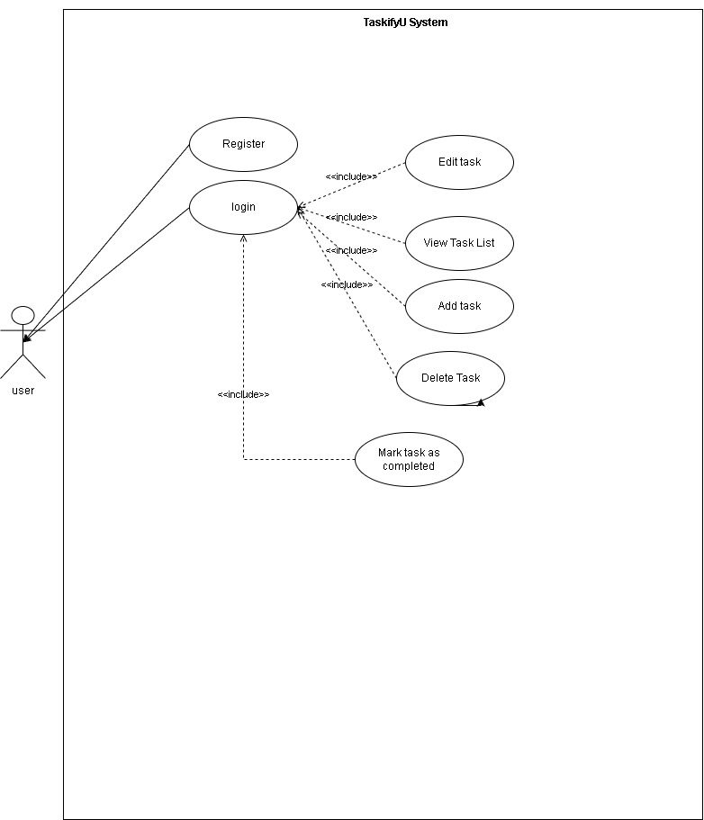
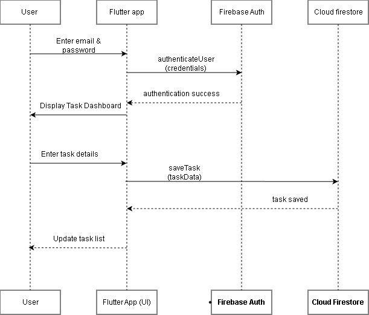
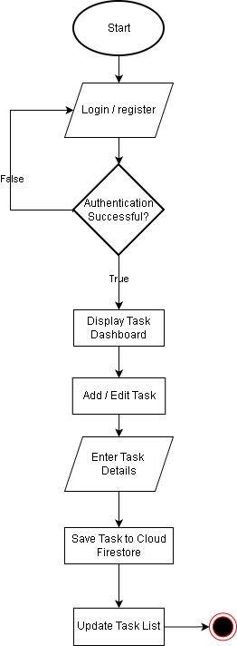

# 📱 TaskifyU – Student Task Management Mobile Application

## 📌 Application Domain
**Productivity / Utilities**

---

## 1. Introduction

University students often struggle to manage assignments, deadlines, and daily academic tasks efficiently due to tight schedules and poor organization. Many existing task management applications are either overly complex or not specifically designed for student productivity.

TaskifyU is a simple hybrid mobile application developed to help students plan, organize, and track their academic tasks effectively. The application focuses on usability, clean user interface design, and essential productivity features. TaskifyU is built using Flutter and Firebase, allowing users to manage tasks anytime and anywhere through a mobile or web-based platform.

---

## 2. Problem Statement

University students often face difficulties in managing multiple academic tasks and deadlines simultaneously. The lack of simple, student-focused task management tools leads to poor organization, missed deadlines, and reduced productivity. Therefore, there is a need for a lightweight and user-friendly task management application that is specifically tailored to students’ academic needs.

---

## 3. Project Objectives

The objectives of this project are:

- To help students manage academic tasks and deadlines efficiently  
- To provide a simple and user-friendly task tracking system  
- To demonstrate hybrid mobile/web application development using Flutter  
- To integrate Firebase services for authentication and cloud-based data storage  

---

## 4. Target Users

The target users of TaskifyU include:

- University students  
- College students  
- Individuals who require simple and effective task planning  

---

## 5. Features and Functionalities

### 5.1 Core Features

- User registration and login using Firebase Authentication  
- Add new tasks with title, description, due date, and priority  
- Edit and delete existing tasks  
- Mark tasks as completed  
- View task list categorized by task status (Pending / Completed)  

### 5.2 Optional Enhancements

- Task filtering by priority or due date  
- Simple dashboard displaying task summary (total, completed, pending tasks)  

---

## 6. Proposed UI Screens

- **Login Page** – Allows users to log in using email and password  
- **Register Page** – Enables new users to create an account  
- **Task List (Home Dashboard)** – Displays all user tasks with status  
- **Add / Edit Task Form** – Allows users to create or update task details  

---

## 7. Architecture and Technical Design

TaskifyU follows a client–cloud architecture model. The Flutter application handles user interactions and UI rendering. Firebase Authentication is used to manage user login and registration securely. Cloud Firestore is used to store and retrieve task data in real time. Provider is used for state management to ensure efficient data sharing across multiple screens.

---

## 8. Technology Stack

- **Framework:** Flutter  
- **Platform:** Hybrid Mobile / Web  
- **State Management:** Provider  
- **Navigation:** Named Routes (`Navigator.pushNamed`)  
- **Authentication:** Firebase Authentication (Email & Password)  
- **Database:** Cloud Firestore  

---

## 9. Data Model

### Collection: `users`

| Field | Type |
|------|------|
| uid | String |
| email | String |
| createdAt | Timestamp |

### Collection: `tasks`

| Field | Type |
|------|------|
| title | String |
| description | String |
| dueDate | Timestamp |
| priority | String |
| isCompleted | Boolean |
| userId | String |

---

## 10. Use Case Diagram

The use case diagram illustrates the interaction between the user and the TaskifyU system. Users must log in before accessing any task management functionality. Task-related operations such as viewing, adding, editing, deleting, and completing tasks include the login process to ensure secure access.

📌 **Diagram:**  

---

## 11. Sequence Diagram

The sequence diagram shows the interaction flow for the Add Task functionality. It demonstrates how the user interacts with the Flutter application, Firebase Authentication, and Cloud Firestore during login and task creation processes.

📌 **Diagram:**  

---

## 12. Flowchart

The flowchart represents the overall workflow of the TaskifyU system. It starts from user authentication and continues through task management processes such as adding, editing, saving tasks, and updating the task list.

📌 **Diagram:**  

---

## 13. User Flow Summary

1. User registers or logs into the application  
2. System verifies authentication  
3. User accesses the task dashboard  
4. User adds, edits, deletes, or completes tasks  
5. Task data is stored in Cloud Firestore  
6. Task list updates in real time  

---

## 14. References

- Flutter Official Documentation  
- Firebase Authentication Documentation  
- Cloud Firestore Documentation  
- Material Design Guidelines  

---

## 📌 Note

This project is developed as part of **INFO 4335 – Mobile Application Development**, demonstrating hybrid mobile application development using Flutter and Firebase.
